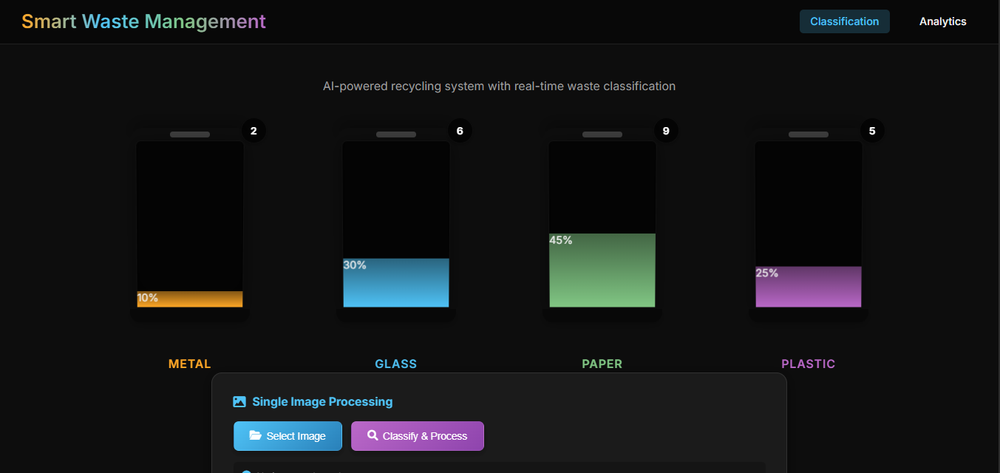
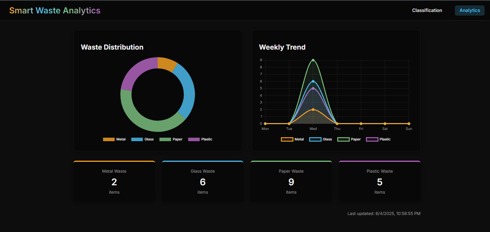
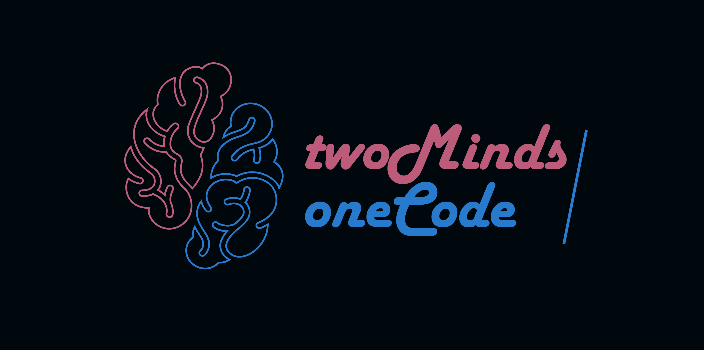

# 🧠 Waste Classification Using Custom CNN Models

This project uses deep learning to automatically classify waste images into four categories: **Metal**, **Paper**, **Plastic**, and **Glass**. It compares multiple custom CNN (Convolutional Neural Network) models to find the best-performing one.

After training, the best model is saved and used in a **Flask web app**. This app allows users to upload images and get instant predictions for better and smarter recycling.

---

## 🎥 Project Demo

  

### [Watch this video on YouTube](https://youtu.be/OhcWuUA0-eI)

---

## 🖼️ Project Screenshots

  

  
  

---

## 🧪 Model Comparison & Results

| Model   | Accuracy | Notes                                             |
|---------|----------|---------------------------------------------------|
| **Model A** | 91.85%    | Best generalization; clean and balanced architecture |
| **Model B** | 88.64%    | Deeper network with excellent stability         |
| Model C | 88.09%    | Good accuracy but some fluctuation in training    |
| Model D | 69.26%    | did not outperform other models   |

### Details of Models in the ( Waste Classification.ipynb file )
---

## 🧠 Technologies Used

| Tool            | Purpose                          |
|-----------------|----------------------------------|
| Python          | Main programming language        |
| TensorFlow/Keras| Deep learning & model building   |
| Flask           | Backend web framework            |
| HTML/CSS        | Frontend UI                      |
| NumPy, Pandas   | Data handling                    |
| Matplotlib      | Visualization of training metrics|

---

## **Team**  

